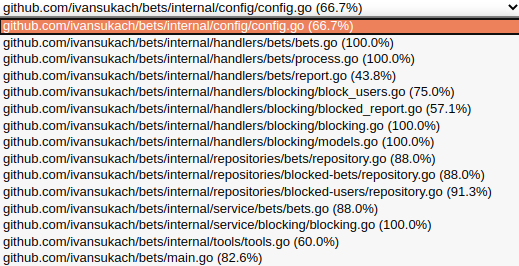

# BETS


[](https://github.com/ivansukach/bets/releases/latest)

The Bets is a ready-to-use application for processing data such as blocking users, processing .csv files, 
that contains information about bets, report blocked users and report bets.


## Quick Start

Let's execute following steps to start:
1. Git clone this repository
2. Run: `cd [your project destination]`
3. Create database "bets"
4. In terminal, you should run command `flyway -locations=filesystem:./migrations -user=su -password=su -url=jdbc:postgresql://localhost:5432/bets migrate`
5. Build and run your application

You can specify your own port in `.env` file.

## Testing

There are test files in repository. If you want to test application - run:
```
go test -v
```
If you want to run all tests of application - run:
```
go test -v ./...
```
To add test coverage - run 
```
go test -v -coverpkg=./... -coverprofile=coverage.out ./...
```

**Result of test coverage:**


## Questions

For questions and support please contact me in [Vkontakte](https://vk.com/steel.muscles). 

## Contributing

We welcome contributions from everyone. The `develop` contains the development version. You can branch of from `develop` and create a pull request, or maintain your own fork and submit a cross-repository pull request.
